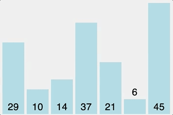

# 버블 정렬(Bubble Sort)

버블 정렬은 두 인접한 원소를 검사하여 정렬하는 방법이다.

<p align="center">
  
  <br>
  <small> 버블 정렬이 진행되는 과정 </small>
</p>

### 정렬 과정

1. 앞에서부터 현재 원소와 바로 다음의 원소를 비교한다.
2. 현재 원소가 다음 원소보다 크면 원소를 교환한다.
3. 다음 원소로 이동해 해당 원소와 그 다음 원소를 비교한다.

### 버블 정렬의 장점 및 단점

#### - 장점

- 추가적인 메모리 소비가 적다.
- 구현이 매우 쉽다.

#### - 단점

- 원소를 하나 씩 비교하기 때문에 비교 횟수가 많아지면 매우 오래걸린다.

## 버블 정렬 구현하기

```java
public void bubbleSort(int[] arr) {
  int size = arr.length;
  for (int i = 1; i < size; i++) {
    for (int j = 0; j < size - i; j++) {
      if (arr[j] > arr[j + 1]) {
        int temp = arr[j];
        arr[j] = arr[j + 1];
        arr[j + 1] = temp;
      }
    }
  }
}
```


---

#### 참고

- [거품 정렬](https://ko.wikipedia.org/wiki/거품_정렬)