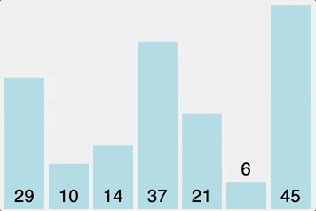

# 선택 정렬(Selection Sort)

현재 위치에 들어갈 원소를 찾아 선택하는 정렬 방법이다.

<p align="center">
  
  <br>
  <small> 선택 정렬이 진행되는 과정 </small>
</p>

### 정렬 과정

1. 주어진 리스트 중에 최소값을 찾는다.
2. 그 값을 맨 앞에 위치한 값과 교체한다.
3. 맨 처음 위치를 뺀 나머지 리스트를 같은 방법으로 교체한다.

### 선택 정렬의 장점 및 단점

#### - 장점

- 추가적인 메모리 소비가 적다.
- 버블 정렬에 비해 빠른 속도를 가진다.

#### - 단점

- 리스트의 크기가 클 수록 효율이 떨어진다.

## 선택 정렬 구현하기

```java
public void selectionSort(int[] arr) {
  int size = arr.length;
  for (int i = 1; i < size - 1; i++) {
    int minIdx = i;
    for (int j = i + 1; j < size; j++) {
      if (arr[j] < arr[minIdx]) {
        minIdx = j;
      }
    }
    int temp = arr[minIdx];
    arr[minIdx] = arr[i];
    arr[i] = temp;
  }
}
```

---

#### 참고

- [선택 정렬](https://ko.wikipedia.org/wiki/선택_정렬)