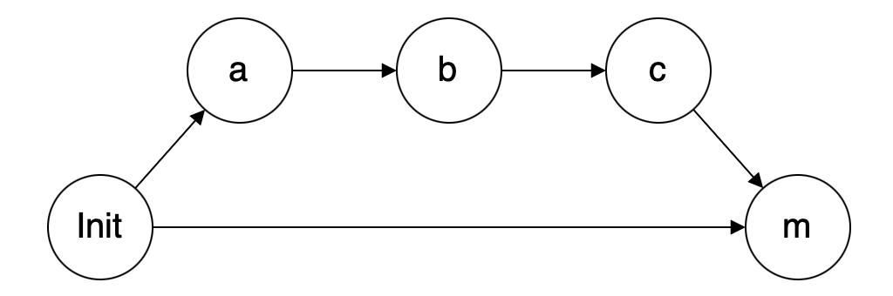
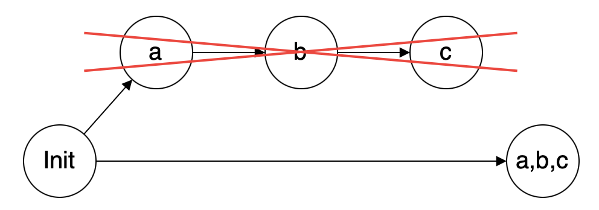
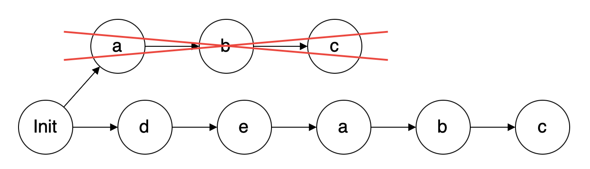

# 다양한 Merge 방식 이해하기

Git은 특정 브랜치에서 작업한 내용을 main 브랜치에 병합(Merge)할 수 있는 다양한 방법을 제공한다.

다양한 방법이 있지만 주로 다음 방법을 사용한다.

- Merge
- Squash and Merge
- Rebase and Merge

위 3 가지 방법 모두 브랜치를 병합하는 기능을 가지고 있지만 어떤 방식을 선택하느냐에 따라 **커밋 히스토리**가 기록되는 방식이 달라진다.

## 🎯 Merge

  

일반적인 병합 방법이다.

- 병합된 브랜치가 삭제되어 사라져도 커밋 히스토리는 남아 있기 때문에 어떻게 진행되었는지를 쉽게 파악할 수 있다.
- 너무 자세하게 커밋 히스토리가 남기 때문에 브랜치의 개수가 많거나 병합 횟수가 많을수록 커밋 히스토리 가독성이 떨어진다.

## 🎯 Squash and Merge

  

여러 개의 커밋을 하나로 합치는 방법이다.

- 병합할 브랜치의 커밋을 전부 하나의 커밋으로 합친 뒤 특정 브랜치에 커밋하는 방식으로 병합을 진행한다.
- 자잘한 커밋 사항이 남지 않기 때문에 깔끔하게 커밋 히스토리를 관리할 수 있다.
- 특정 브랜치의 커밋 히스토리 관리는 쉬우나 모든 커밋을 하나로 통합해버리기 때문에 자세한 정보를 알 수 없다.
- 병합된 사실 자체는 알 수 있으나 어떤 상황에 어떤 코드를 변경 했는지는 알 수 없다.

## 🎯 Rebase and Merge

  

Git의 Rebase 기능을 사용해 브랜치를 병합하는 방법이다.

- 커밋 순서가 아닌 병합된 순서대로 기록된다.
- 병합시 커밋 기록이 남지 않기 때문에 하나의 브랜치에서 작업한 것처럼 보여진다.

---

#### 📌 참고

- [GitHub의 Merge, Squash and Merge, Rebase and Merge 정확히 이해하기](https://meetup.toast.com/posts/122)