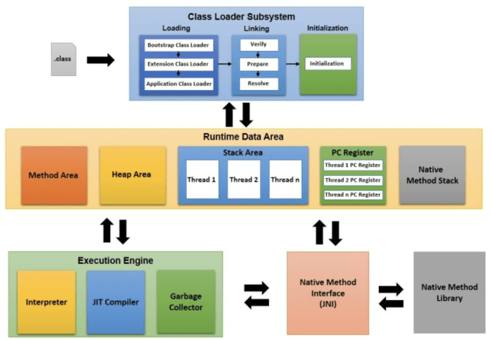

# 자바 가상 머신(JVM, Java Virtual Machine)

JVM은 Java와 운영체제 사이에서 중개자 역할을 수행하여 자바 바이트 코드(.class)를 운영체제에 맞는 코드로 변환시켜 실행시키는 역할을 수행한다.

> 바이트 코드란 JVM에서 동작하도록 만들어진 이진 코드로 명령어의 크기가 1Byte라서 바이트 코드라고 불리운다.

- 자바 프로그램은 운영체제에 독립적이다.
- 하지만 JVM은 운영체제에 의존하기 때문에 운영체제 맞는 JVM을 설치해야 한다.
- Garbage Collector를 통한 메모리 관리
- ARM 아키텍쳐 같은 하드웨어는 레지스터 기반으로 동작하는데 비해 JVM은 스택 기반으로 동작한다.

## JVM 구성요소

### 자바 프로그램 실행 과정

- 자바 프로그램이 실행되면 JVM은 OS로부터 프로그램이 필요로 하는 메모리를 할당받는다.
- 자바 컴파일러에 의해 자바 파일이 자바 바이트 코드(.class)로 변환된다.
- 클래스 로더를 통해 자바 바이트 코드를 JVM으로 올린다.
- 실행 엔진에의해 해석된 바이트 코드는 런타임 데이터 영역에 배치되어 수행된다.
- 실행 중 JVM은 필요에 따라 GC같은 관리 작업을 수행한다.

  
   
  <small>출처: https://www.bhrikutisoft.com/2020/02/how-jvm-works.html</small>

### Class Loader

JVM으로 `.class` 파일을 로드하고 링크를 통해 배치하는 작업을 수행한다.

- Runtime시에 동적으로 클래스를 로드한다. 클래스를 처음으로 참조할 때 해당 클래스를 로드하고 링크한다.
- `jar`파일에 저장된 클래들을 JVM에 탑재하고 사용하지 않는 클래스들은 메모리에서 삭제한다.

### Execution Engine

메모리에 적재된 바이트 코드를 기계어로 변경해 명령어 단위로 실행 및 바이트 코드를 운영체제에 맞게 해석해주는 작업을 수행한다.

이 때 실행 엔진이 명령어 단위로 읽어서 수행하는데 크게 인터프리터와 JIT 방식이 사용된다.

#### 인터프리터

- 바이트 코드를 명령어 단위로 읽어서 실행한다.
- 인터프리터 언어의 단점인 한 줄 씩 수행하기 때문에 느리다.

#### JIT(Just-In-Time)

- 인터프리터 방식의 단점을 보완하기 위해 도입되었다.
- 인터프리터 방식으로 실행하다가 적절한 시점에 바이트 코드 전체를 컴파일해 네이티브 코드로 변경 후 네이티브 코드를 직접 실행하는 방식이다.
- JIT를 사용하는 JVM은 내부적으로 해당 메소드가 얼마나 자주 호출되는지 체크하고 일정 정도를 넘을 때에만 컴파일을 수행한다.

### Garbage Collector

사용하지 않는 인스턴스를 찾아 메모리에서 삭제하는 작업을 수행한다.

### Runtime Date Area

프로그램을 수행하기 위해 OS에서 할당받은 메모리 공간이다.

#### PC Register

쓰레드가 시작될 때 생성되며 생성될 때마다 생성되는 공간으로 쓰레드마다 하나씩 존재한다.

- 메소드 안에서 바이트 코드 몇 번째 줄을 실행하고 있는지와 같은 정보를 가지고 있다.

#### JVM Stack

프로그램 실행과정에서 임시로 할당되었다가 메소드를 빠져나가면 바로 소멸되는 특성의 데이터를 저장하기 위한 공간이다.

- 각 쓰레드마다 하나씩 존재하며 쓰레드가 시작될 때 생성된다.
- 메소드 호출 시 각각의 스택 프레임(해당 메소드를 위한 공간)이 생성된다.
- 메소드가 호출될 때마다 push 연산을 수행하고 메소드 수행이 끝나면 프레임별로 삭제하며 이 때 pop 연산을 수행한다.
- 메소드 안에서 사용되는 값 및 호출된 메소드의 매개변수, 지역변수, 반환 값, 연산 시 일어나는 값, 참조 변수 등을 임시로 저장한다.

#### Navite Method Stack

실제 실행할 수 있는 기계어로 작성된 프로그램을 실행시키는 영역이다.

- Java가 아닌 다른 언어로 작성된 코드를 위한 공간이다.
- JNI(Java Native Interface)를 통해 바이트 코드로 전환하여 저장한다.

#### Method Area

클래스 정보를 처음 메모리 공간에 올릴 때 초기화되는 대상을 저장하기 위한 공간이다.

- 모든 쓰레가 공유한다.
- 클래스, 인터페이스, 메소드, 멤버변수, Static 변수 등이 올라간다.
- GC의 관리 대상이다.
- Static Area, Class Area라고도 불린다.

#### Heap

객체를 저장하는 가상 메모리 공간으로 `new` 연선자로 생성된 인스턴스와 배열을 저장한다.

- 모든 쓰레드가 공유한다.
- Method Area에 올라온 클래스들만 인스턴스를 생성할 수 있다.
- GC의 관리 대상이다.

---

#### 참고

- <https://asfirstalways.tistory.com/158>
- <https://steady-coding.tistory.com/587>