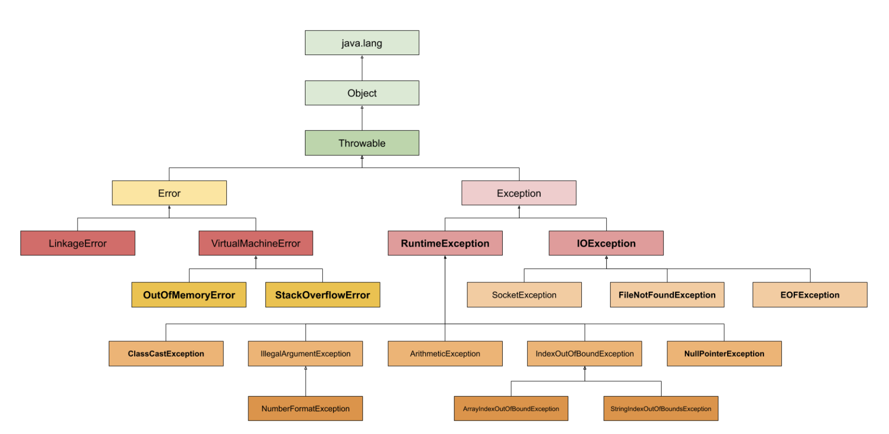

# 예외 처리(Exception Handling)

프로그램이 실행 중 어떤 원인에 의해 오작동을 하거나 비정상적으로 종료되는 경우를 프로그램 에러 또는 오류라고 한다.

발생시점에 따라 다음 두 가지로 나눌 수 있다.

- **컴파일 에러(Compile-time error):** 컴파일 할 때 발생하는 에러
- **런타임 에러(Runtime error):** 프로그램 실행도중에 발생하는 에러

위 두가지 외에도 컴파일도 잘되고 실행도 잘되지만 의도한 것과 다르게 동작하는 논리적 에러(Logical error)가 있다.

자바는 실행 시 발생할 수 있는 프로그램 오류를 에러(Error)와 예외(Exception) 두 가지로 구분했다.

- **에러(Error):** 프로그램 코드에 의해서 수습될 수 없는 심각한 오류
- **예외(Exception):** 프로그램 코드에 의해서 수습될 수 있는 심각한 오류

## 🎯 예외 클래스 계층구조

자바는 실행 시 발생할 수 있는 오류(Exception & Error)를 클래스로 정의했다.

모든 클래스의 상위 클래스가 Object 클래스인 것처럼 Exception 클래스와 Error 클래스도 Object 클래스의 하위 클래스이다.

<p align="center">
  
  <br/>
  <small>
  출처: https://sematext.com/blog/java-exceptions/
  </small>
</p>

## 🎯 try-catch

예외 처리란 프로그램 실행 시 발생할 수 있는 예외 발생에 대비한 코드를 작성하는 것이다.

- 예외 처리의 목적은 예외의 발생으로 인한 실행 중인 프로그램의 비정상적인 종료를 막고 정상적인 실행 상태를 유지하기 위함이다.

예외를 처리하기 위해 `try - catch`를 사용하는 방법이 있으며 구조는 다음과 같다.

```java
try {
  // 예외가 발생할 가능성이 있는 코드
} catch (ExceptionA e1) {
  // ExceptionA가 발생했을 경우 처리하기 위한 코드
} catch (ExceptionB e2) {
  // ExceptionB가 발생했을 경우 처리하기 위한 코드
} catch (ExceptionC e3) {
  // ExceptionC가 발생했을 경우 처리하기 위한 코드
}
```

- 하나의 try 블럭 다음에는 여러 종류의 예외를 처리할 수 있도록 하나 이상의 catch 블럭이 올 수 있다.
- 발생한 예외의 종류와 일치하는 한 개의 catch 블럭이 수행된다.
- 발생한 예외의 종류와 일치하는 catch 블럭이 없으면 예외는 처리되지 않는다.

### try-catch 흐름

try-catch문 에서 예외가 발생한 경우와 발생하지 않았을 때의 흐름이 달라진다.

- **try 블럭 내에서 예외가 발생한 경우**
  - 발생한 예외와 일치하는 catch 블럭이 있는지 확인한다.
  - 일치하는 catch 블럭을 찾게 되면 해당 catch 블럭 내의 코드를 수행하고 전체 try-catch 문을 빠져나가고 다음 코드를 계속해서 수행한다.
  - 만약 일치하는 catch 블럭을 찾지 못하면 예외는 처리되지 못한다.
- **try 블럭 내에서 예외가 발생하지 않는 경우**
  - catch 블럭을 거치치 않고 전체 try-catch문을 빠져나가 다음 코드를 계속해서 수행한다.

### 예외 발생과 catch 블럭

catch 블럭은 괄호()와 블럭 {} 두 부분으로 나누어져 있다.

```java
try {
  ...
} catch(ExceptionA e1) {
  ...
} catch(ExceptionB e2) {
  ...
}
```

괄호() 내에는 처리하고자 하는 예외와 같은 타임의 참조변수를 선언해야 한다.

- 예외가 발생하면 발생한 예외에 해당하는 클래스의 인스턴스가 만들어 진다.
- catch 블럭이 여러 개일 경우 첫 번째 catch 블럭부터 차례로 내려가면서 괄호() 내에 선언된 참조변수의 종류와 생성된 예외 클래스의 인스턴스에 `instanceof` 연산자를 사용해 결과가 true인 catch 블럭을 만날 때 까지 검사를 계속한다.
- 검사 결과가 true인 catch 블럭을 찾으면 블럭에 있는 코드를 수행한 try-catch 문을 빠져나가고 예외는 처리되지만 true인 블럭이 없으면 예외는 처리되지 않는다.

모든 예외 클래스는 Exception 클래스의 하위 클래스이기 때문에 catch 블럭의 괄호()에 Exception 클래스 타입의 참조변수를 선언하면 어떤 종류의 예외가 발생해도 해당 catch 블럭에서 처리된다.

### 멀티 catch 블럭

JDK 1.7부터 여러 catch 블럭을 `|` 기호를 이용해 하나의 catch 블럭으로 합칠 수 있게되었으며 이를 멀티 catch 블럭이라 한다.

```java
try {
  ...
} catch (ExceptionA | ExceptionB e) {
  ...
}
```

- 멀티 catch 블럭을 사용해 중복된 코드를 줄일 수 있다.
- `|` 기호로 연결할 수 있는 예외 클래스의 개수에는 제한이 없다.

만약 멀티 catch 블럭의 `|` 기호로 연결된 예외 클래스가 상속 관계에 있다면 컴파일 에러가 발생한다.

```java
try {
  ...
} catch (SuperException | SubException e) {
  ...
}

try {

} catch (SuperException e) {
  ...
}
```

- 두 예외 클래스가 상속 관계에 있다면 상위 클래스만 써주는 것과 똑같다.
- 불필요한 코드는 제거하라는 의미에서 컴파일 에러가 발생한다.

멀티 catch 블럭은 하나의 catch 블럭으로 여러 예외를 처리하는 것이다.

- 발생한 예외를 멀티 catch 블럭으로 처리했을 때 어떤 예외가 발생한 것인지 알 수 없다.
- 참조변수 e로 멀티 catch 블럭에 `|` 기호로 연결된 예외 클래스들은 공통 분모인 상위 예외 클래스에 선언된 멤버만 사용할 수 있다.

```java
try {
  ...
} catch (ExceptionA | ExceptionB e) {
  e.methodA();  // Error!! ExceptionA에 선언된 methodA()는 호출할 수 없다.

  if (e instanceof ExceptionA) {
    ExceptionA e1 = (ExceptionA) e;
    e1.methodA();
  } else if (e instanceof ExceptionB) {
    ExceptionB e1 = (ExceptionB) e;
    e1.methodB();
  }
    ...
  }
  ...
}
```

- 필요할 경우 `instanceof`로 어떤 예외가 발생한 것인지 확인하고 개별적으로 처리할 수 있지만 사용하는 경우는 거의 없다.

## 🎯 예외 발생시키기

`throw` 키워드를 사용해 개발자가 고의로 예외를 발생시킬 수 있다.

```java
Exception e = new Exception("Error!!");

throw e;
```

## 🎯 메소드에 예외 선언하기

메소드에 예외를 선언하려면 선언부에 `throws` 키워드를 사용해 메소드 내부에서 발생할 수 있는 예외를 적으면 된다.

- 예외가 여러 개일 경우 쉼표(,)로 구분한다.
- 메소드의 선언부에 예외를 선언해 메소드를 사용하려는 개발자들이 메소드의 선언부를 보고 해당 메소드를 사용하기 위해서는 어떠한 예외들이 처리되어야 하는지 쉽게 파악할 수 있다.
- 메소드 내에서 발생할 가능성이 있는 예외를 메소드의 선언부에 명시해 해당 메소드를 사용하려는 개발자는 이에 대한 처리를 강요하기 때문에 견고한 프로그램 코드를 작성하는데 도움이 된다.
- 메소드에 예외를 선언하는 경우는 보통 반드시 처리해주어야 하는 예외들만 선언한다.

```java
void method() throws Exception1, Exception2 {
  ...
}
```

- 모든 예외의 상위 클래스인 Exception 클래스를 메소드에 선언하면 해당 메소드는 모든 종류의 예외가 발생할 가능성이 있다는 뜻이다.
- Exception 예외 뿐만 아니라 Exception을 상속 받고 있는 하위 클래스까지 예외가 발생할 수 있기 때문에 주의가 필요하다.

## 🎯 finally 블록

finally 블록에는 에외 발생 여부에 상관없이 실행되어야할 코드를 작성한다.

- try-catch 문의 끝에 선택적으로 덧붙여 사용할 수 있으며 try-catch-finally의 순서로 구성된다.

```java
try {
  ...
} catch (Exception e) {
  ...
} finally {
  // 예외 발생 여부에 상관없이 항상 수행되어야하는 코드를 작성한다.
  // finally는 맨 마지막에 위치해야 한다.
  ...
}
```

## 🎯 사용자 정의 예외

필요에 따라 개발자가 새로운 예외 클래스를 정의해 사용해야 하는 경우가 있다.

- 보통은 Exeption 클래스나 RuntimeException 클래스를 상속받아 예외 클래스를 만들지만 필요에 따라 알맞은 예외 클래스를 선택할 수 있다.

```java
class FooException extends RuntimException {
  ...
}
```

## 🎯 예외 되던지기

```java
public static void main(String[] args) {
  try {
    method();
  } catch(Exception e) {
    System.out.println("main hello, world!");
  }
}

static void method() throws Exception {
  try {
    throw new Exception();
  } catch(Exception e) {
    System.out.println("method hello, world!");
    throw e;
  }
}

// Result
// method hello, world!
// main hello, world!
```

- 예외를 처리한 후에 다시 예외를 발생시킨다.
- 호출한 메소드와 호출된 메소드 양쪽 모두 예외를 처리한다.

---

#### 참고

- [자바의 정석](http://www.yes24.com/Product/Goods/24259565)