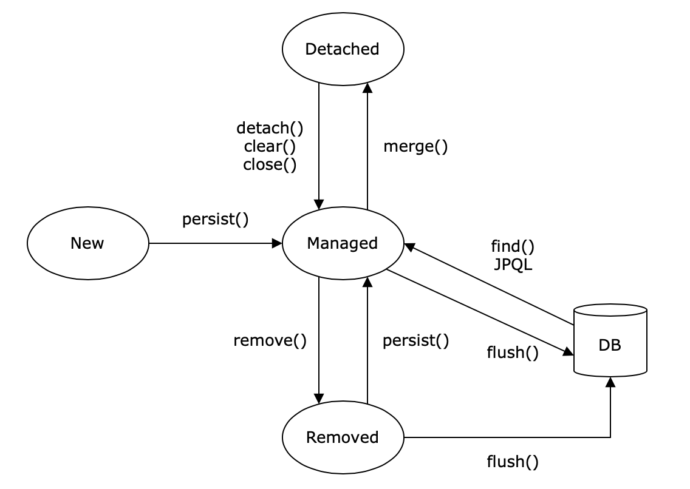

# 엔티티 생명주기

엔티티에는 4가지 상태가 존재한다.

- 비영속(new/transient): 영속성 컨텍스트와 전혀 관계가 없는 상태
- 영속(managed): 영속성 컨텐스트에 저장된 상태
- 준영속(detached): 영속성 컨텍스트에 저장되엇다가 분리된 상태
- 삭제(removed): 삭제된 상태

<p align="center">
  
</p>

### 비영속

순수한 객체 상태이며 영속성 컨텍스트와 관련이 없는 상태이다.

```java
Member member = new MembeR("yoonminsoo");
```

### 영속

엔티티 매니저를 통해 엔티티를 영속성 컨텍스트에 저장되어 영속성 컨텍스트가 관리하는 상태

- 영속성 컨텍스트가 관리하는 엔티티를 영속 상태라 한다.
- 영속 상태라는 것은 영속성 컨텍스트에 의해 관리된다는 것이다.

```java
// 객체를 저장한 상태(영속)
em.persist(member);
```

### 준영속

영속성 컨텍스트에 저장되었다가 분리된 상태이다.

영속 상태의 엔티티를 준영속 상태로 만들려면 아래 3가지 방법이 있다.

- **em.detach():** 특정 엔티티를 준영속 상태로 만든다.
- **em.close():** 영속성 컨텍스트를 닫는다.
- **em.clear():** 영속성 컨텍스트를 초기화한다.

```java
// 회원 엔티티를 영속성 컨텍스트에서 분리, 준영속 상태
em.detach(member);
```

### 삭제

엔티티를 영속성 컨텍스트와 데이터베이스에서 삭제한 상태이다.

```java
// 객체를 삭제한 상태(삭제)
em.remove(member);
```

---

#### 참고

- [자바 ORM 표준 JPA 프로그래밍](http://www.yes24.com/Product/goods/19040233)