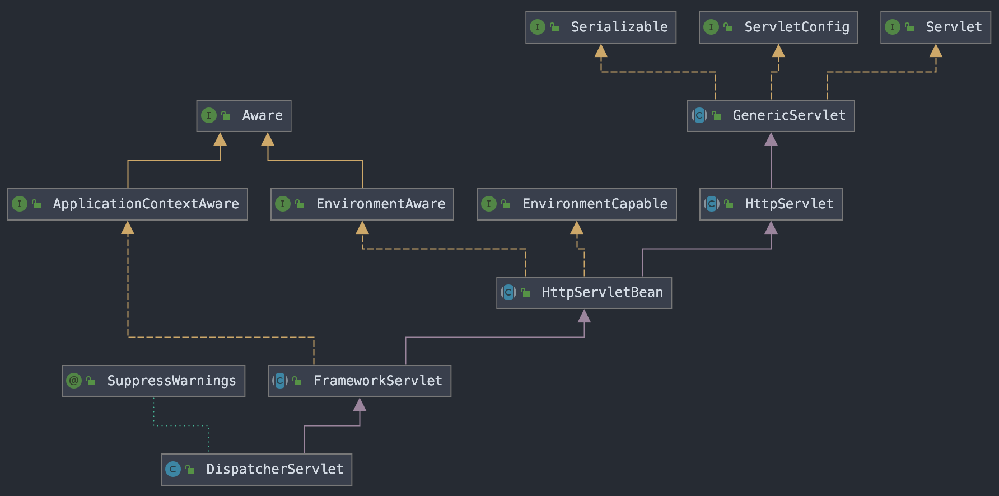

# DispatcherServlet

DispathcerServlet은 HTTP를 통해 들어오는 모든 요청을 받아 적절한 핸들러로 처리를 위임해주는 프론트 컨트롤러(Front Controller)이다.

### DispatcherServlet 계층 구조

  
   
  <small><strong>DispatcherServlet 계층 구조</strong></small>

- DispatcherServlet은 HttpServlet을 상속받아 사용하며 서블릿으로 동작한다.
- 스프링 부트는 DispatcherServlet을 자동으로 서블릿으로 등록하면서 모든 경로에대해서 매핑한다.

### DispatcherServlet 요청 처리과정

- 클라이언트가 요청을 보내면 가장 먼저 동작하는 곳은 HttpServlet의 service() 메소드이다.
- DispatcherServlet의 상위 클래스인 FrameworkServlet은 service() 메소드를 오버라이딩하고 있다.
- 따라서 FrameworkServlet의 service()를 시작으로 여러 메소드가 호출되면서 DispatcherServlet의 doDispatch()가 호출된다.

### DispatcherServlet의 doDispatch() 코드로 알아보기

  
   
  <small><strong>DispatcherServlet의 doDispatch()</strong></small>

- 가장 먼저 doDispatch()는 클라이언트의 요청에 해당하는 핸들러를 조회한다.
- 다음으로 조회한 핸들러를 통해 요청을 처리할 핸들러 어댑터를 조회한다.

 

  
   
  <small><strong>DispatcherServlet의 doDispatch()</strong></small>

- 핸들러 어댑터를 통해 핸들러를 실행하고 ModelAndView를 반환한다.
- processDispatchResult() 메소드를 호출한다.

 

  
   
  <small><strong>DispatcherServlet의 processDispatchResult()</strong></small>

- processDispatchResult에서는 render()를 호출한다.

 

  
   
  <small><strong>DispatcherServlet의 render()</strong></small>

- render() 메소드는 ViewResolver를 통해 뷰를 찾고 해당 View를 반환받는다.
- 마지막으로 뷰를 렌더링한다.

## Spring MVC 동작 순서

위에서 DispatcherServlet가 동작하는 코드를 따라가보면 결국 다음과 같이 동작하는 것을 알 수 있다.

  
   
  <small>
    출처:
    <strong>
      <a href="https://www.inflearn.com/course/스프링-mvc-1/dashboard">스프링 MVC 1편 - 백엔드 웹 개발 핵심 기술</a>
    </strong>
  </small>

1. 핸들러 조회
2. 핸들러 어댑터 조회
3. 핸들러 어댑터 실행
4. 핸들러 실행
5. ModelAndView 반환
6. ViewResolver 호출
7. View 반환
8. 뷰 렌더링

---

#### 참고

- [[Spring] Dispatcher-Servlet(디스패처 서블릿)이란? 디스패처 서블릿의 개념과 동작 과정](https://mangkyu.tistory.com/18)
- [An Intro to the Spring DispatcherServlet](https://www.baeldung.com/spring-dispatcherservlet)
- [스프링 공식 문서](https://docs.spring.io/spring-framework/docs/current/reference/html/web.html#spring-web)
- [스프링 MVC 1편 - 백엔드 웹 개발 핵심 기술](https://www.inflearn.com/course/스프링-mvc-1/dashboard)