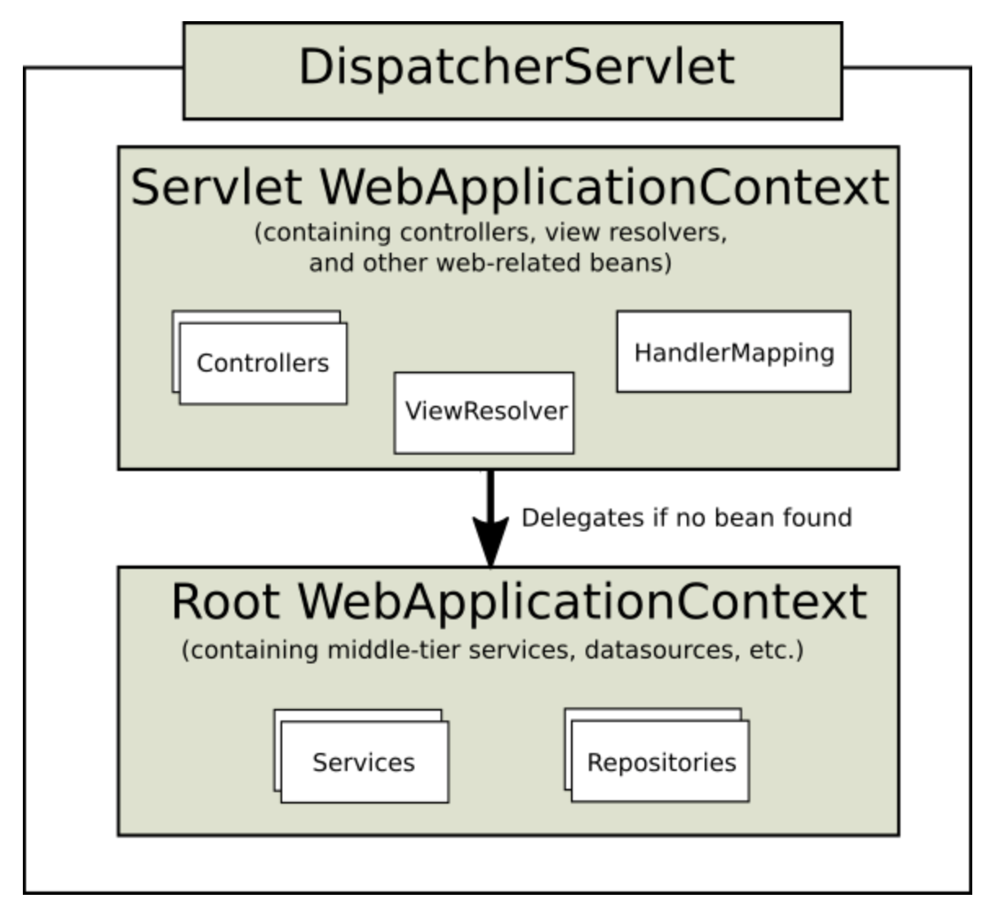
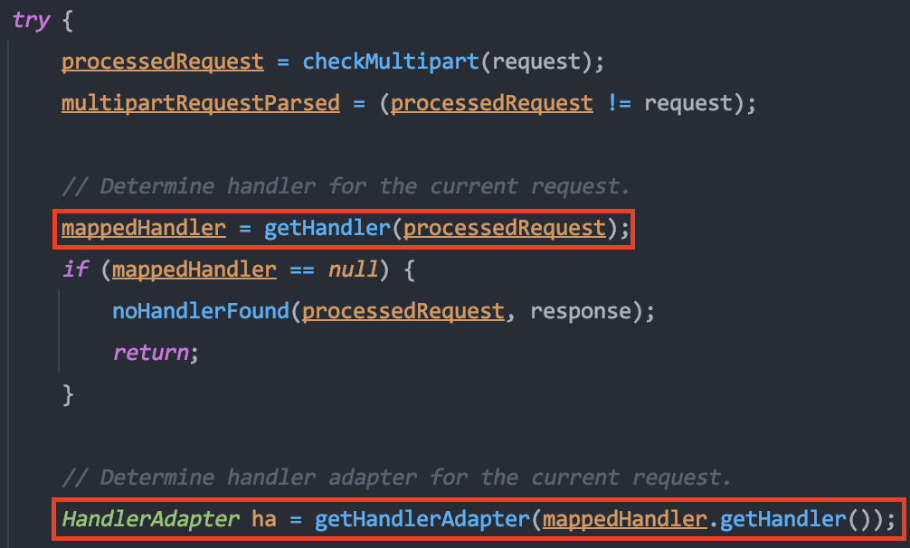
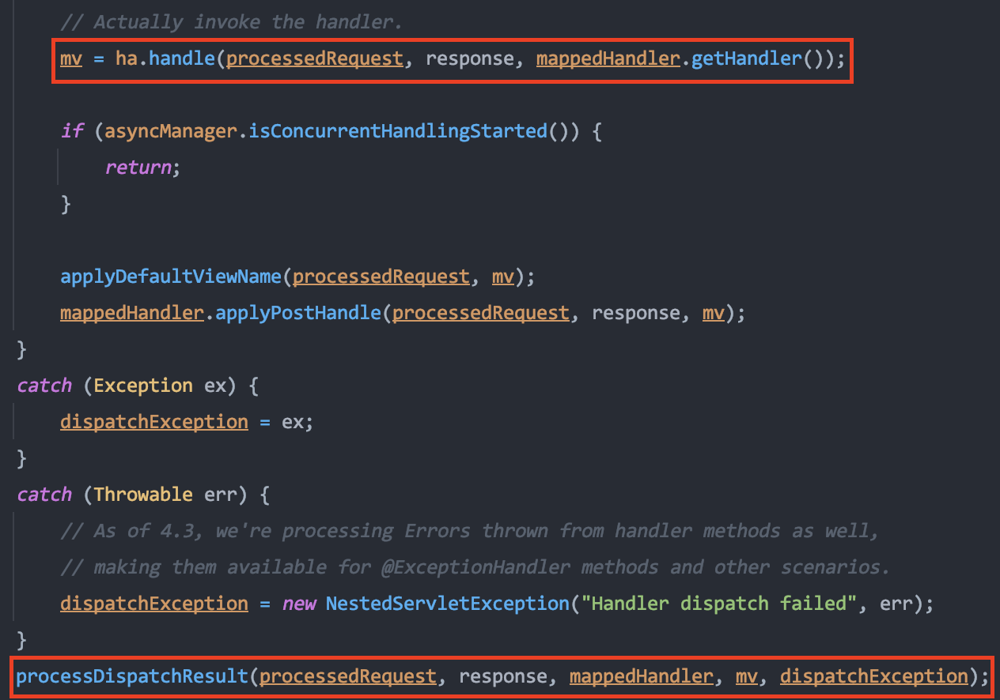
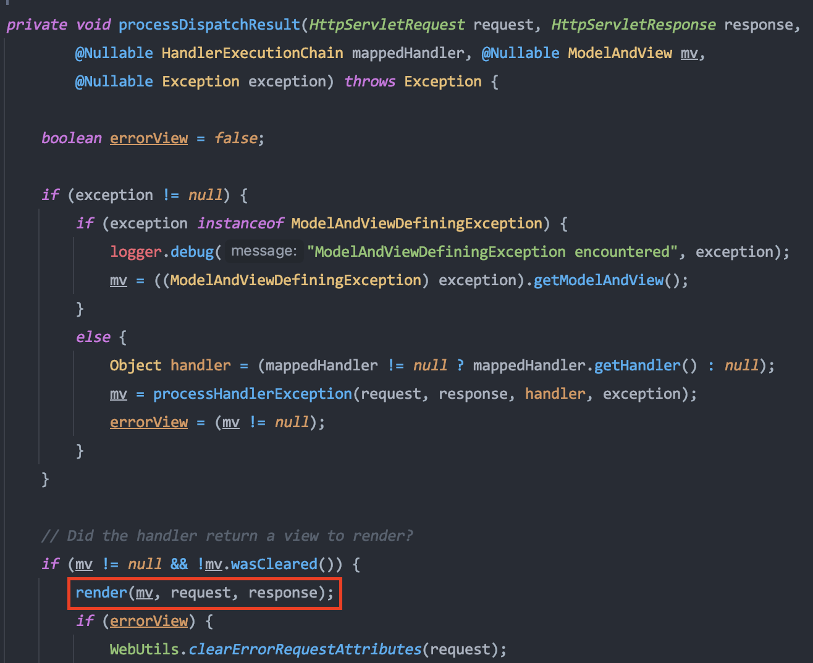
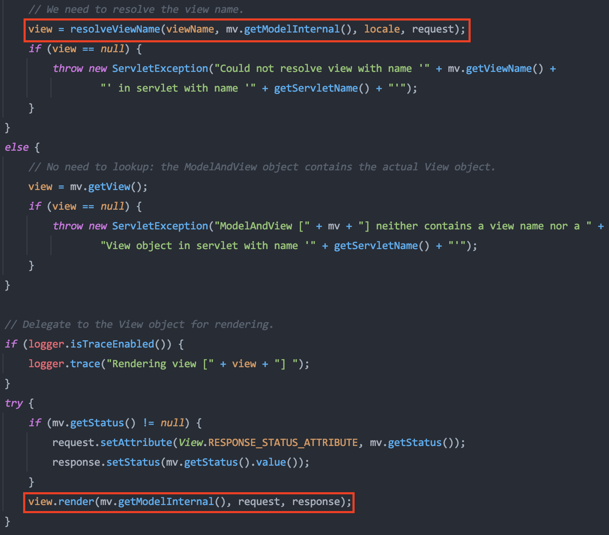
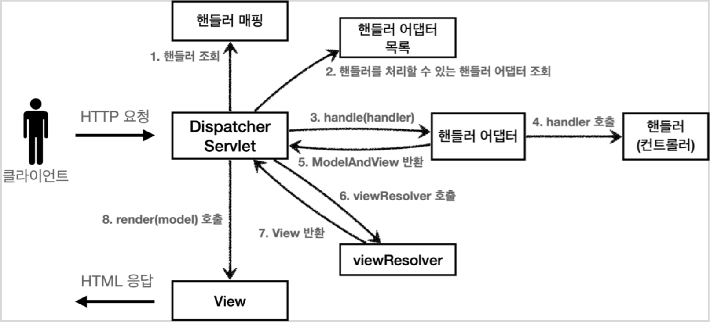

# DispatcherServlet

DispathcerServlet은 HTTP를 통해 들어오는 모든 요청을 받아 적절한 핸들러로 처리를 위임해주는 프론트 컨트롤러(Front Controller)로 모든 요청을 한 곳에서 받아 필요한 처리들을 수행한 다음 요청에 맞는 Handler로 요청을 위임하고 해당 Handler의 실행 결과를 반환하는 역할을 한다.

## ▶︎ DispatcherServlet 구조

  
   
  <small>
    <strong>출처: 스프링 공식 문서</strong>
  </small>

### Servlet WebApplicationContext

- 클라이언트의 요청을 받기위한 진입점으로 서블릿의 Context 설정이다.
- 요청을 처리해 줄 Controller, ViewResolver, HandlerMapping 등 웹과 관련되어 있는 Bean들을 정의하고 있다.
- Servlet WebApplicationContext는 Root WebApplicationContext에 등록된 Bean들을 참조해 사용할 수 있다.

### Root WebApplicationContext

- Services, Repositories 같이 웹 환경에 독립적인 하는 Bean들을 정의하고 있다.
- Root WebApplicationContext에 등록된 Bean은 모든 Context에서 사용할 수 있다.
- 서로 다른 Servlet WebApplicationContext에서 공유해야 하는 Bean들을 정의해놓고 사용할 수 있다.
- Root WebApplicationContext는 Servlet WebApplicationContext에 등록된 Bean들을 참조할 수 없다.

### 왜 이런 구조를 가질까?

대부분의 애플리케이션은 하나의 WebApplicationContext만 사용해도 충분하지만 여러 개의 DispatcherServlet이 필요한 애플리케이션이 있을 수도 있기 때문에 Root WebApplicationContext를 상속받아 필요한 기능을 추가해 사용하도록 구조를 만들었다.

## ▶︎ DispatcherServlet 요청 처리과정

- 클라이언트가 요청을 보내면 가장 먼저 동작하는 곳은 HttpServlet의 service() 메소드이다.
- DispatcherServlet의 상위 클래스인 FrameworkServlet은 service() 메소드를 오버라이딩하고 있다.
- 따라서 FrameworkServlet의 service()를 시작으로 여러 메소드가 호출되면서 DispatcherServlet의 doDispatch()가 호출된다.

  
   
  <small><strong>DispatcherServlet의 doDispatch()</strong></small>

- 가장 먼저 doDispatch()는 클라이언트의 요청에 해당하는 핸들러를 조회한다.
- 다음으로 조회한 핸들러를 통해 요청을 처리할 핸들러 어댑터를 조회한다.

 

  
   
  <small><strong>DispatcherServlet의 doDispatch()</strong></small>

- 핸들러 어댑터를 통해 핸들러를 실행하고 ModelAndView를 반환한다.
- processDispatchResult() 메소드를 호출한다.

 

  
   
  <small><strong>DispatcherServlet의 processDispatchResult()</strong></small>

- processDispatchResult에서는 render()를 호출한다.

 

  
   
  <small><strong>DispatcherServlet의 render()</strong></small>

- render() 메소드는 ViewResolver를 통해 뷰를 찾고 해당 View를 반환받는다.
- 마지막으로 뷰를 렌더링한다.

## ▶︎ Spring MVC 동작 순서

위에서 DispatcherServlet가 동작하는 코드를 따라가보면 결국 다음과 같이 동작하는 것을 알 수 있다.

  
   
  <small>
    출처:
    <strong>
      <a href="https://www.inflearn.com/course/스프링-mvc-1/dashboard">스프링 MVC 1편 - 백엔드 웹 개발 핵심 기술</a>
    </strong>
  </small>

1. 핸들러 조회
2. 핸들러 어댑터 조회
3. 핸들러 어댑터 실행
4. 핸들러 실행
5. ModelAndView 반환
6. ViewResolver 호출
7. View 반환
8. 뷰 렌더링

---

#### 참고

- [스프링 공식 문서](https://docs.spring.io/spring-framework/docs/current/reference/html/web.html#spring-web)
- [[Spring] Dispatcher-Servlet(디스패처 서블릿)이란? 디스패처 서블릿의 개념과 동작 과정](https://mangkyu.tistory.com/18)
- [An Intro to the Spring DispatcherServlet](https://www.baeldung.com/spring-dispatcherservlet)
- [스프링 MVC 1편 - 백엔드 웹 개발 핵심 기술](https://www.inflearn.com/course/스프링-mvc-1/dashboard)
- [Spring servlet-context.xml, root-context.xml, web.xml](https://nancording.tistory.com/86)
- <https://galid1.tistory.com/525>