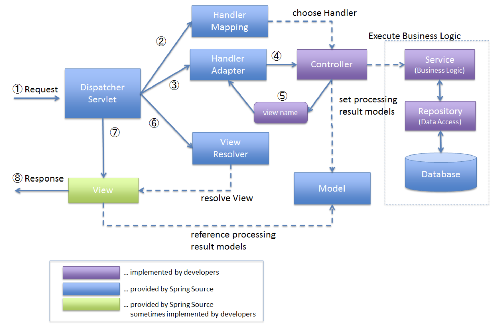

# 스프링 MVC 동작 과정

  
   
  <small>출처: <a href="https://terasolunaorg.github.io/guideline/5.0.1.RELEASE/en/Overview/SpringMVCOverview.html#overview-of-spring-mvc-processing-sequence">https://terasolunaorg.github.io/</a></small>

### ① HTTP를 통해 들어오는 클라이언트의 모든 요청은 DispatcherServlet으로 전달된다.

- 웹 요청을 LocalResolver, ThemeResolver, MultipartResvoler 인터페이스에 구현체에서 분석한다.

### ② DispatcerServlet은 HandlerMapping에게 위임해 해당 요청을 처리할 수 있는 Handler(Controller)를 탐색한다.

### ③ DispatcerServlet은 찾은 Handler를 실행할 수 있는 HandlerAdapter를 탐색한다.

### ④⑤ 찾은 HandlerAdapter를 통해 Handler를 실행한다.

- 이때 Handler의 반환 값은 ModelAndView이다.

### ⑥ DispatcerServlet은 뷰 이름을 ViewResolver에게 전달하고 ViewResolver는 해당하는 View 객체를 반환한다.

### ⑦ DispatcerServlet은 View에게 Model과 함께 화면 표시를 위임한다.

- 이때 Model이 null이라면 View를 그대로 사용한다.
- 값이 있다면 View에 Model 데이터를 렌더링한다.

### ⑧ DispatcerServlet은 View 결과를 클라이언트에게 반환한다.

---

#### 참고

- [DispatcherServlet - Part 1](https://tecoble.techcourse.co.kr/post/2021-06-25-dispatcherservlet-part-1/)