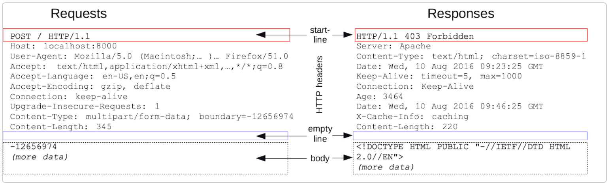
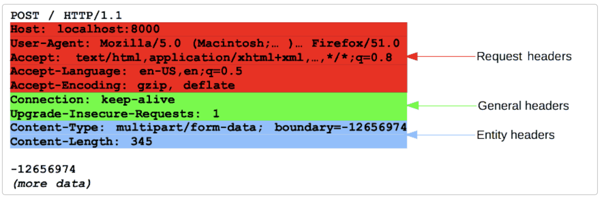
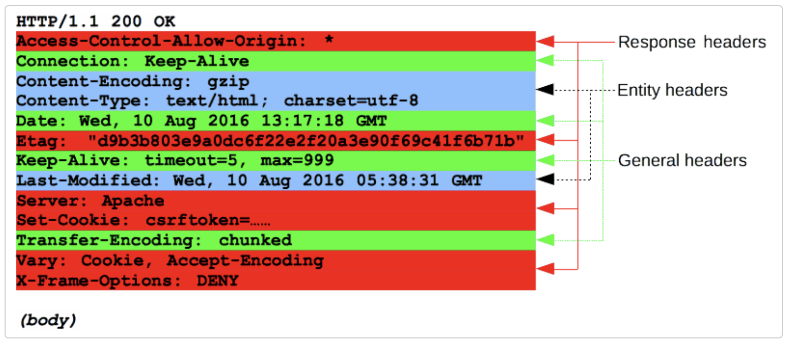

# HTTP(HyperText Transfer Protocol)

HTTP는 HTML 문서와 같은 리소스들을 가져올 수 있도록 해주는 프로토콜로 웹에서 이루어지는 모든 데이터 교환의 기초이다.

- HTML, TEXT, JSON, XML IMAGE, 음성, 영상 등 거의 모든 형태의 데이터를 전송 할 수 있다.
- 서버 간 데이터를 주고 받을 때도 대부분 HTTP를 사용한다.

## ▶︎ HTTP 특징

### 클라이언트 서버 구조

- 요청과 응답으로 이루어져 있다.
- 클라이언트는 서버에 요청을 보내고 응답을 대기한다. 서버는 클라이언트의 요청에 대한 결과를 만들어서 응답한다.
- 비즈니스 로직은 서버가 담당하고 클라이언트는 UI와 사용성에 집중한다.

### 비연결성(Connectionless)

HTTP는 연결을 유지하지 않는 것을 기본으로 동작한다.

- 클라이언트가 서버와 통신을 한 다음, 해당 통신을 끊지 않고 계속 유지하게 되면 지속적으로 자원이 소모되기 때문에 클라이언트와 서버가 통신을 주고 받은 다음 바로 연결을 끊고 필요할 때 다시 연결해 요청과 응답을 주고 받는다.
- 서버 자원을 효율적으로 사용할 수 있다.

비연결성으로 인해 매번 TCP/IP 연결을 맺어야 한다. 즉 통신을 맺고 끊는 비용이 비싸다.

- 다시 연결을 하는 과정에서 HTML, CSS, JS, 이미지 등 많은 자원이 함께 다운로드된다.
- HTTP는 지속 연결(Persistent Connections)로 문제를 해결했다.
- 만약 자주 데이터를 요청해야 하는 경우 통신을 맺었다 끊는 것보다는 통신을 일정 기간 유지하는 것이 좋은 방법이다.

### 무상태(Stateless)

HTTP를 이용한 통신에서 서버는 클라이언트의 상태를 저장하지 않는다.

- Stateless에서 서버는 단순히 클라이언트의 요청에 대한 결과를 응답하는 작업을 수행한다.
- 서버의 확장성이 높기 때문에 대량의 트래픽이 발생해도 효과적으로 대처할 수 있다.
- 서버는 클라이언트의 상태를 저장하지 않는다. 따라서 매번 요청을 보낼 때마다 부가정보를 보내야 한다. 즉, 클라이언트에서 추가 데이터를 전송한다.

반대로 서버가 클라이언트의 상태를 유지하는 것을 Stateful이라고 한다.

클라이언트의 요청이 서버에 전달되었을 때 클라이언트의 다음 요청이 이전 요청과 관계가 이어진다.

- 로그인한 사용자의 경우 로그인 했다는 상태를 유지할 필요가 있다.
- 일반적으로 브라우저의 쿠키나 서버 세션 등을 사용해 상태를 유지한다.
- 상태유지는 최소한만 사용하는 것이 좋다.

## ▶︎ HTTP 메시지

HTTP 메시지는 서버와 클라이언트 간에 데이터가 교환되는 방식으로 HTTP에서 핵심적인 역할을 하며 구조도 단순하게 이루어져 있어 확장성도 뛰어나다.

메시지 타입은 다음 두 가지가 있다.

- 요청(request)은 클라이언트가 서버로 전달해서 서버의 액션이 일어나게끔 하는 메시지이다.
- 응답(response)은 요청에 대한 서버의 답변이다.

HTTP 요청과 응답 메시지의 구조는 서로 비슷하며 구조는 다음과 같다.

- 시작 줄(start-line)은 실행되어야할 요청 또는 요청 수행에 대한 성공 또는 실패가 기록되어 있다.(항상 한 줄로 끝난다)
- 옵션으로 HTTP 헤더가 들어간다. 여기는 요청에 대한 설명 혹은 메시지 본문에 대한 설명이 들어간다.
- 요청에 대한 모든 메타 정보가 전송되었음을 알리는 빈 줄(blank line)이 삽입된다.
- 요청과 관련된 내용이 옵션으로 들어가거나 응답과 관련된 문서가 들어간다.(본문의 존재 여부 및 크기는 첫 줄과 HTTP 헤더에 명시된다)

  
   
  <small>
    출처:
    <a href="https://developer.mozilla.org/ko/docs/Web/HTTP/Messages">
      HTTP 메시지
    </a>
  </small>

### HTTP 요청

HTTP 요청은 서버가 특정 동작을 취하게끔 만들기 위해 클라이언트에서 전송하는 메시지이다.

#### 🎯 시작 줄
시작 줄은 다음 세 가지 요소로 이루어져 있다.

##### 1. HTTP 메소드

- 수행할 작업(GET, POST, PUT, DELETE)이나 방식(OPTIONS, HEAD)을 설명한다.
- GET 메소드는 자원을 클라이언트로 가져다 달라는 것을 의미하며 POST 메소드는 데이터가 서버로 들어가야 한다는 의미이다.

##### 2. 요청 타켓

- 요청 대상또는 프로토콜, 포트, 도메인의 절대 경로 또는 요청 컨텍스트에 의해 특정지어 진다.
- 요청 형식은 HTTP 메소드에 따라 갈라진다.

**origin 형식**

- ?와 쿼리 문자열이 붙는 절대 경로로 가장 일반적인 형식이며 GET, POST, HEAD, OPTIONS 등의 메소드와 함께 사용한다.

**absolute 형식**

- 완전한 URL 형식으로 프록시에 연결하는 경우 대부분 GET 메소드와 함께 사용한다.

**authority 형식**

- 도메인 이름과 포트 번호로 이루어진 URL의 autority component 이다. HTTP 터널을 구축하는 경우 CONNECT와 함께 사용할 수 있다.

**asterisk 형식**

- OPTIONS와 함께 별표(*) 하나로 간단하게 서버 전체를 나타낸다.

##### 3. HTTP 버전

마지막으로 HTTP 버전이 들어가며 응답 메시지에서 사용해야 할 HTTP 버전을 알려주는 역할을 한다.

#### 🎯 헤더

대소문자 구분없는 문자열 다음에 콜론(:)이 붙으며 뒤에 오는 값은 헤더에 따라 달라진다.

  
   
  <small>
    출처:
    <a href="https://developer.mozilla.org/ko/docs/Web/HTTP/Messages">
      HTTP 메시지
    </a>
  </small>

**Request Headers**

- User-Agent, Accept-Type, Accept-Length와 같은 헤더는 요청을 보다 구체화한다.
- Referer를 사용해 컨텐스트를 제공하거나 If-None과 같이 조건에 따라 제약 사항을 추가할 수 있다.

**General Headers:**

- 메시지 전체에 적용된다.

**Entity Headers:**

- Content-length 같은 헤더는 요청 본문(Body)에 적용된다.
- 요청 내에 본문이 없는 경우 Entity Header는 전송되지 않는다.

#### 🎯 본문

HTTP 메시지 구조의 마지막에 위치하며 모든 요청에 본문이 들어가있는 것은 아니다.

- GET, HEAD, DELETE, OPTIONS 처럼 자원을 가져오는 요청은 보통 본문이 필요하지 않다.
- POST, PUT과 같은 일부 요청은 업데이트를 하기 위해 서버에 데이터를 전송한다.

**단일 리소스 본문(single-resource bodies)**

- 헤더 두 개(Content-Length, Content-Type)로 정의된 단일 파일로 구성된다.

**다중 리소스 본문(multiple-resource bodies)**

- 각 파트마다 다른 정보를 지니게 되며 보통 HTML Form과 관련이 있다.

### HTTP 응답

#### 🎯 상태 줄

HTTP 응답 메시지의 시작 줄은 상태 줄(status-line)이라고 한다.

1. 프토로콜 버전
2. 상태 코드 - 요청의 결과를 나타낸다 (200, 400, 404 등)
3. 상태 텍스트 - 짧고 간결하게 상태 코드에 대한 설명을 글로 나타낸다.
4. ex) HTTP/1.1 404 Not Found

#### 🎯 헤더

대소문자 구분없는 문자열 다음에 콜론(:)이 붙으며 뒤에 오는 값은 헤더에 따라 달라진다.

  
   
  <small>
    출처:
    <a href="https://developer.mozilla.org/ko/docs/Web/HTTP/Messages">
      HTTP 메시지
    </a>
  </small>

**Respones Headers**

- Vary, Accept-Ranges와 같이 상태 줄에 넣기에는 공간이 부족했던 추가 정보를 제공한다.

**General Headers:**

- 메시지 전체에 적용된다.

**Entity Headers:**

- Content-length 같은 헤더는 요청 본문(Body)에 적용된다.
- 요청 내에 본문이 없는 경우 Entity Header는 전송되지 않는다.

#### 🎯 본문

HTTP 메시지 구조의 마지막에 위치하며 모든 응답에 본문이 들어가지는 않는다.

- 201, 204와 같은 상태 코드를 가진 응답에는 보통 본문이 없다.

**이미 길이가 알려진 단일 파일로 구성된 단일-리소스 본문**

- 헤더 두개(Content-Type와 Content-Length)로 정의 한다.

**길이를 모르는 단일 파일로 구성된 단일-리소스 본문**

- Transfer-Encoding가 chunked로 설정되어 있으며, 파일은 청크로 나뉘어 인코딩 되어 있다.

**서로 다른 정보를 담고 있는 멀티파트로 이루어진 다중 리소스 본문**

- 이 경우는 상대적으로 위의 두 경우에 비해 보기 힘들다.

---

#### 참고

- [HTTP 개요](https://developer.mozilla.org/ko/docs/Web/HTTP/Overview)
- [모든 개발자를 위한 HTTP 웹 기본 지식](https://www.inflearn.com/course/http-웹-네트워크/dashboard)